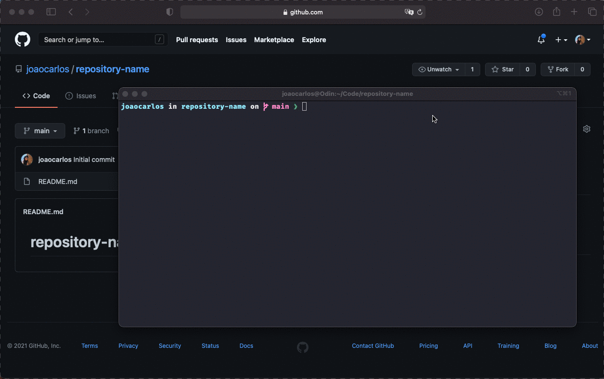
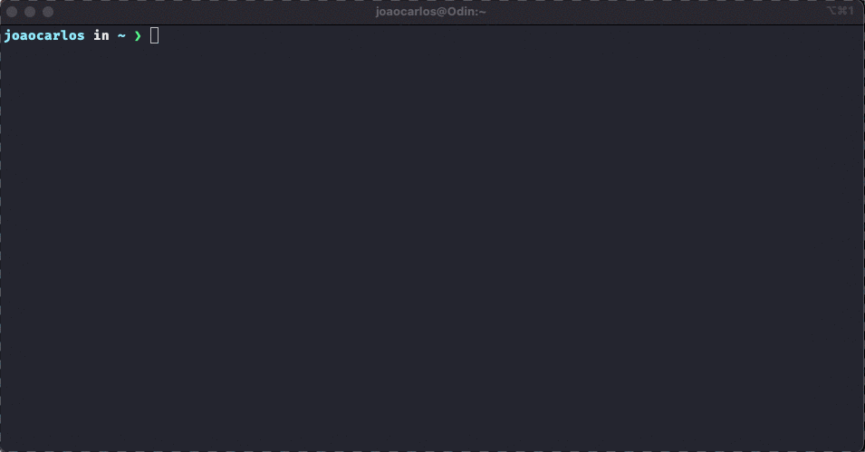
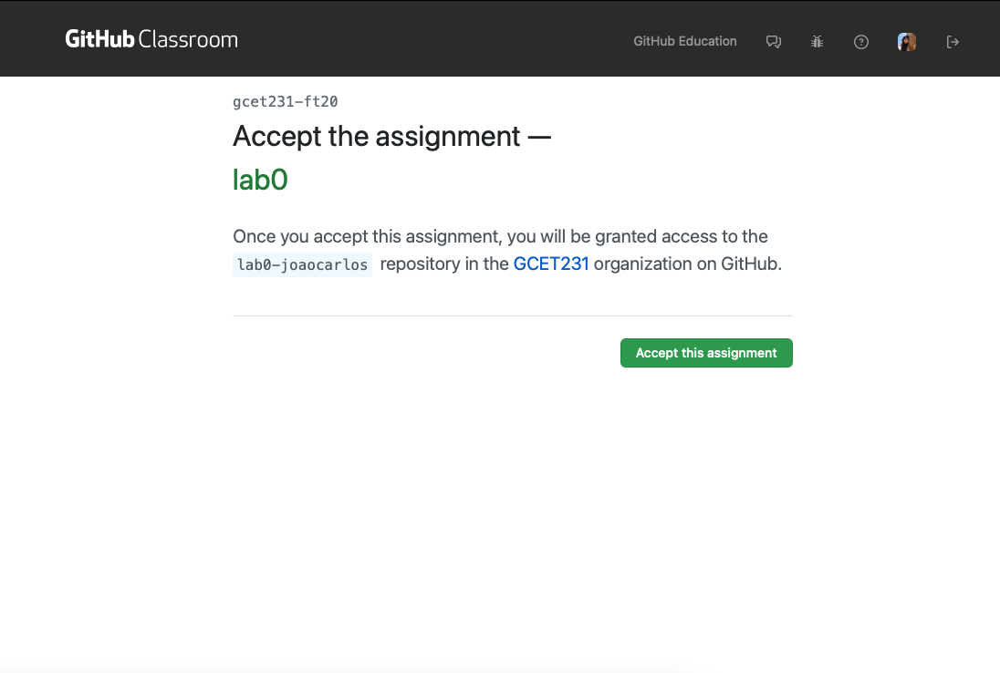
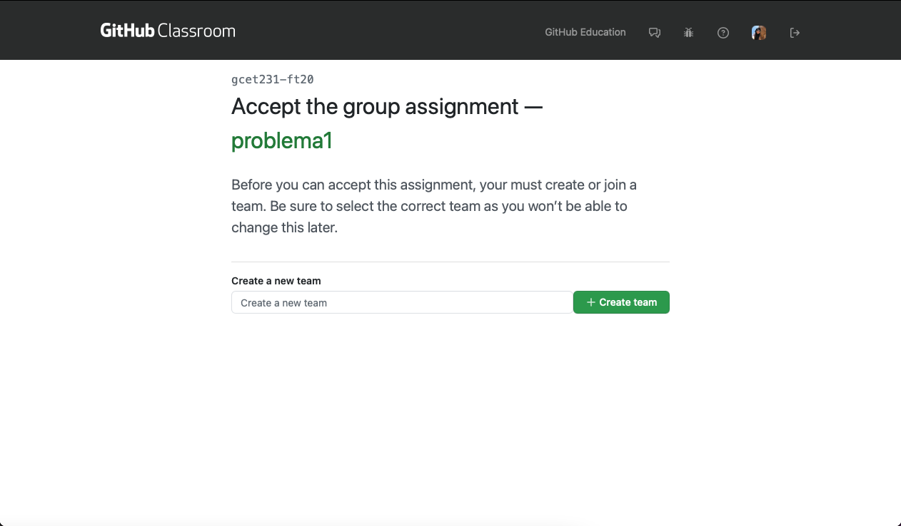

# Guia de Comandos Básicos do Git

- [Instalando o Git](#instalando-o-git)
- [Configurando seu acesso ao Github](#configurando-seu-acesso-ao-github)
  - [Chaves SSH](#chaves-ssh)
- [Guia Prático do GitHub](#guia-pr-tico-do-github)
  - [Criando um repositório no GitHub](#criando-um-reposit-rio-no-github)
  - [Clonando o repositório para seu computador](#clonando-o-reposit-rio-para-seu-computador)
  - [Fazendo mudanças locais, commit e push e confirmando que as mudanças locais foram enviadas para o servidor remoto no GitHub](#fazendo-mudan-as-locais--commit-e-push-e-confirmando-que-as-mudan-as-locais-foram-enviadas-para-o-servidor-remoto-no-github)
- [Passo-a-passo para baixar e editar tarefas a partir do GitHub Classroom](#passo-a-passo-para-baixar-e-editar-tarefas-a-partir-do-github-classroom)
  - [Organizando os diretórios](#organizando-os-diret-rios)
  - [Ingressando no repositório de uma tarefa do GitHub Classroom](#ingressando-no-reposit-rio-de-uma-tarefa-do-github-classroom)
  - [Gerenciando as mudanças e adicionando novos arquivos ao seu repositório local](#gerenciando-as-mudan-as-e-adicionando-novos-arquivos-ao-seu-reposit-rio-local)
  - [Atualizando o servidor remoto (GitHub)](#atualizando-o-servidor-remoto--github-)
- [Recursos Adicionais](#recursos-adicionais)

## O que é Git

O Git é um sistema de controle de versão de código robusto e completo. Sistemas de controle de versão ajudam na busca por modificações nos códigos-fonte ao longo do tempo e facilitam o compartilhamento de mudanças provenientes dos seus colaboradores. Para projetos classificados em qualquer nível de complexidade, algum mecanismo de controle de versão é uma ferramenta de grande necessidade. 

Existem diversos sistemas de controle de versão por aí, cada um com suas vantagens e desvantagens. No nosso curso usaremos o Git, um dos sistemas de controle de versão mais populares entre os desenvolvedores do planeta. 

É importante que você faça um esforço para entender como o Git funciona, pois assim você perceberá como é fácil usá-lo no cotidiano. O link a seguir apresenta uma boa visão geral e pode servir como guia de consulta rápida no futuro:

[https://rogerdudler.github.io/git-guide/index.pt_BR.html](https://rogerdudler.github.io/git-guide/index.pt_BR.html)

Uma vez que você tenha entendido o material acima, complete o tutorial a seguir:

[http://try.github.com](http://try.github.com)

O Git é uma ferramenta muito poderosa, mas que pode ser um pouco complicada no começo. Se você não sabe o que está fazendo, pode causar muitas dores de cabeça tanto para você mesmo como para aqueles à sua volta. Então seja cuidadoso! Se você estiver em dúvida sobre como fazer algo com Git, pergunte para o seu professor ou a algum colega mais experiente.

Para o propósito das nossas atividades, você provavelmente precisará dominar os comandos a seguir:

- `git status`
- `git add`
- `git commit`
- `git pull`
- `git push`
- `git clone`

Entretanto, se você deseja realmente entender como usar alguns recursos mais poderosos (`diff`, `blame`, `branch`, `log`, `mergetool`, `rebase`, e muitos outros), saiba que eles podem aumentar muito a sua sua produtividade.

O Git possui um vasto conjunto de funcionalidades muito bem documentada na Internet. Se há alguma coisa que você acredita que o Git pode fazer, existe uma grande chance de um comando para isso já existir. Nós encorajamos você a explorar e discutir com seus colegas e professores.

_Opcional:_ Se você deseja explorar mais alguns comandos avançados, confira [um tutorial um pouco mais avançado](https://github.com/GCET231/tutorial1-github/tree/main/Git_to_Manage_RTL).

## Instalando o Git

O Git é uma ferramenta nativa (já vem instalada junto com o sistema) em sistemas Linux e MacOS. Instruções sobre como instalar o Git podem ser encontradas [aqui](http://happygitwithr.com/install-git.html). Usuários do sistema Windows devem seguir a Opção 1 na seção 6.2.

Após instalar o Git em seu sistema, abra o terminal e execute o comando abaixo para garantir que tudo está dentro do esperado:

` git --version`

Instruções mais detalhadas sobre a instalação no Windows podem ser encontradas [neste vídeo](https://youtu.be/F_fPEMnr1OQ) (em inglês).

## Configurando seu acesso ao Github

Nós usaremos o GitHub como nosso servidor Git remoto ao longo do semestre. O GitHub é um serviço de hospedagem Git que tem sido a casa de vários projetos privados e públicos (_open-source_).

### Chaves SSH

O GitHub autentica você para acessar os seus repositórios remotos utilizando chaves SSH. Siga o tutorial abaixo para configurar suas chaves SSH (isso deve ser feito nos computadores do laboratório quando estiver autenticado com sua conta, assim como no seu próprio computador). Você pode cadastrar mais de uma chave, se desejar.

Primeiro, certifique-se de ter o OpenSSH instalado em seu computador digitando o comando `ssh` no seu terminal. Em seguida, crie uma nova chave SSH (utilize o e-mail institucional caso esteja em um computador do laboratório):

`ssh-keygen -t rsa -b 4096 -C "seu_email@ufrb.edu.br"`

Pressione enter e use as configurações padrão. Não é necessário introduzir uma senha.

Em seguida, execute o comando a seguir no terminal:

`cat ~/.ssh/id_rsa.pub`

No Windows você pode tentar o comando:

`notepad C:\Users\WINUSER/.ssh/id_rsa.pub`

Copie toda a chave pública que foi exibida. Acesse o endereço [https://github.com/settings/keys](https://github.com/settings/keys), clique no botão "New SSH Key", cole sua chave pública na caixa de texto (você também pode dar um nome para sua chave), e clique em "Add SSH key"

Finalmente, teste sua conexão SSH seguindo as instruções presentes no site: [https://help.github.com/articles/testing-your-ssh-connection/](https://help.github.com/articles/testing-your-ssh-connection/)

Se enfrentar algum problema durante o processo, pergunte ao seu professor.

## Guia Prático de uso do GitHub

### Criando um repositório no GitHub

A seguir nós criamos um repositório e copiamos o link para que possamos baixá-lo no nosso próprio computador.


### Clonando o repositório remoto para seu computador

Para clonar um repositório, utilize o comando a seguir:

`git clone https://github.com/joaocarlos/repository-name.git`


### Fazendo mudanças locais, commit, push e confirmando que as mudanças locais foram enviadas para o servidor remoto no GitHub

Siga os passos a seguir para aprender como fazer seu primeiro registro no GitHub.



## Passo-a-passo para baixar e editar tarefas a partir do GitHub Classroom

### Organizando os diretórios

> Reserve uma pasta no seu computador (ou dispositivo de armazenamento externo) especificamente para a nossa turma (chame de algo como gcet231-2020.1). Dentro dessa pasta eu recomendo que você crie uma pasta chamada aulas, assim como as pastas para as práticas de laboratório, questionários, laboratórios e projetos.

Você pode fazer isso como faria normalmente apontando e clicando, mas você também pode usar o *shell* (Terminal ou CMD/PowerShell)! Essa é uma boa prática se você pensa em usar o Git fora da nossa aula, onde você normalmente precise usar Shell para interagir com o Git. 

O autor Sean Kross apresenta um ótimo guia para uso do shell aqui -- [https://seankross.com/the-unix-workbench/](https://seankross.com/the-unix-workbench/). Entretanto, eu irei mostrar aqui os comandos básicos que você precisa para dar os primeiros passos.

Uma coisa que o Shell proporciona é possibilitar que você navegue através de todos os seus arquivos digitando comandos, no lugar de usar o mouse. Quando você abrir o shell você pode digitar `pwd`. Esse comando diz a você o diretório (pasta) em que você se encontra.

Você pode também digitar `ls`. Esse comando lista os diretórios dentro do diretório. Por exemplo, quando eu digito `pwd`, o resultado é `/Users/joaocarlos`. Essa resposta me diz que eu estou no meu próprio diretório dentro do meu computador. Quando eu digito `ls`, eu vejo os diretórios tais como Applications, Documents, etc...

Eu posso ainda entrar em um diretório usando o comando `cd`. Se eu digitar `cd Documents`, estarei agora dentro do meu diretório Documents. Quando eu digito `pwd`, o resultado exibe `/Users/joaocarlos/Documents`. Eu posso então retornar para a pasta `/Users/joaocarlos` digitando o comando `cd ..`.



Agora eu desejo criar um novo diretório. Para isso, eu posso utilizar o comando `mkdir`. Por exemplo, para criar um diretório chamado nome-da-turma (é uma boa prática não ter espaços nos nomes das suas pastas), eu posso digitar:

`mkdir nome-da-turma`.

Se você digitar `ls`, agora verá que o diretório `nome-da-turma` aparecerá. Você pode digitar `cd nome-da-turma` para entrar no diretório. Finalmente, você pode criar os outros diretórios dos quais falamos digitando:

```
mkdir aulas
mkdir laboratorios
```

Veja o exemplo a seguir:

```
Users
|
|
|____joaocarlos
     |
     |
     |____documentos-ufrb
          |
          |
          |____gcet231-circuitos-digitais-ii-2020.1
               |
               |
               |____aulas
               |
               |
               |____laboratorios
               |
               |
               |____problemas
```

### Gerenciando as mudanças e adicionando novos arquivos ao seu repositório local

Após realizar as mudanças na sua tarefa ou projeto, realize o commit delas. O que são *commits*? Você pode estar se perguntando! Commits estão na prática tirando um retrato dos seus projetos. Por exemplo, se você fizer modificações em um código que imprime "Hello word", e então realizar o commit com uma mensagem informativa, eu serei capaz de olhar no histórico dos meus commits e visualizar o código que escrevi naquele momento. 

Se eu fizer mais mudanças na função que resultem em um erro, poderia ainda retornar para o commit onde o código estava funcionando. Isso evita a necessidade de criar várias versões dos seus trabalhos (`lab0-ver1`, `lab0-ver2`, ...), ou tente lembrar de como o código era antes da mudança.

Alguns editores de código já possuem integração com Git e facilitam o trabalho de adicionar novos arquivos e gerenciar os commits. Se preferir, pode ainda utilizar gerenciadores como o [GitKraken](https://www.gitkraken.com), mas recomendo que no início você prefira usar o shell para aprender os principais comandos.

Para adicionar os arquivos ao repositório local do Git, você pode usar o comando `git add nome-do-arquivo`. O comando `git add` também é utilizado para incluir arquivos modificados em um commit. O `git add -A` faz com que o Git adicione todas as modificações desde o último commit. Entretanto, se você não quer incluir todas as mudanças ainda, poderá optar por incluir no commit apenas alguns arquivos fazendo `git add arquivo1`, por exemplo.

Você pode fazer um commit usando o comando:

`git commit -m "Mensagem descritiva do commit"`

Duas coisas são importantes em relação ao processo de commit. Primeiro, você deve registrar suas alterações com um commit com alguma frequência. No mínimo, se você está implementando um roteiro de laboratório, deve fazer um commit a cada etapa concluída do roteiro. No caso de projetos mais longos, tente submeter uma modificação sempre que adicionar uma nova funcionalidade ou cumprir uma meta atribuída. Segundo, deixe mensagens de commit informativa, principalmente se estiver trabalhando em grupo. Uma mensagem do tipo _"Adicionando alguma coisa"_ não vai ajudar você a procurar por uma alteração no histórico de commits. Uma mensagem como _"Adicionada versão inicial da função hello-world"_ será muito mais útil.

### Atualizando o servidor remoto no GitHub

Em algum momento você deve querer que a versão atualizado da tarefa seja enviada para o GitHub, seja por que o professor ou monitor podem ajudá-lo com seu código, ou para que ele possa ser avaliado. Você pode fazer isso usando o comando `git push`. Fácil!

Se estiver trabalhando em grupo, é importante garantir que o seu código esteja atualizado antes de um push. Para atualizar o seu repositório local e obter a versão mais recente do GitHub, você tem apenas que digitar o comando `git pull`. Se você receber uma mensagem de erro informando que ouve um conflito de merge, não se desespere! Isso pode acontecer se você editar um arquivo que foi modificado por um colega ou pelo seu professor (no caso dos repositórios gerenciados por ele, como os de material de aula ou de esqueleto de projeto). Os professores farão o melhor para que isso não aconteça, mas se acontecer consulte [esse tutorial](https://github.com/GCET231/tutorial1-github/tree/main/Git_to_Manage_RTL).

### Ingressando no repositório de uma tarefa do GitHub Classroom

Em algumas tarefas, nós forneceremos a você um link para as tarefas por e-mail ou através do site/LMS do curso. Isso irá acontecer para cada tarefa. Siga as instruções para configurar o repositório do seu trabalho e você então terá um repositório para enviar seu trabalho. Aqui está uma imagem que você deve visualizar após clicar no link do convite:



Note que, após você aceitar uma tarefa pela primeira vez, nós iremos enviar um convite para você ingressar como membro da sala do GitHub Classroom (se isso ainda não tiver sido feito). Você deve receber um e-mail com o convite, mas também poderá ver um link no topo da sua página principal no GitHub. Por favor, aceite o convite.

Se a tarefa for em grupo, além de aceitar a tarefa, você deve escolher ou criar um grupo (de acordo com a política da tarefa). Certifique-se de combinar a criação dos grupos com seus colegas antes para evitar problemas.



Entre no repositório criado no GitHub (ele ainda está online -- GitHub é diferente do Git!) Clique em "Code", e garanta que esteja vendo "SSH" em negrito no topo esquerdo da caixa de pop-up box. Se não, clique na botão "SSH" no topo do lado esquerdo. Agora copie o link da caixa para a área de transferência.

Agora você pode ir até o terminal e usar o comando `git clone link-do-repositório`, onde `link-do-repositorio` deve ser substituído pela URL que você copiou, dentro do diretório específico (laboratórios, problemas, projetos, etc.). Isso irá criar uma cópia local do repositório remoto.

Infelizmente, o Quartus Prime ainda não possui suporte para uso de sistemas de controle de versão. Neste caso, você pode seguir utilizando os comandos terminal ou integrar o projeto ao seu editor preferido (Sublime Text, VSCode, GVim, Emacs, etc.).

<!--
A seguir apresentamos uma ilustração do processo de clonar uma tarefa dentro do seu computador através do terminal e abrindo o projeto no Visual Studio Code.


-->

Caso encontre algum erro ao clonar o repositório seguindo as instruções acima, você pode ter que utilizar HTTPS no lugar do SSH. Você pode fazer isso clicando novamente no botão "Code" na página do repositório, e em seguida em "HTTPS" no topo esquerdo na caixa de diálogo. Agora copie o link e repita o procedimento.

## Recursos Adicionais

- [Instalando o Git (Linux, Windows e Mac)](https://git-scm.com/book/pt-br/v2/Começando-Instalando-o-Git)
- [Configurando rapidamente repositórios Git e Github pelo VS Code](https://youtu.be/H0SQAW9tmmE)
- [The Unix Workbench](https://seankross.com/the-unix-workbench/)
- [Interactive learning guide for Git](https://learngitbranching.js.org)
- [GitHub Guides](https://guides.github.com)
